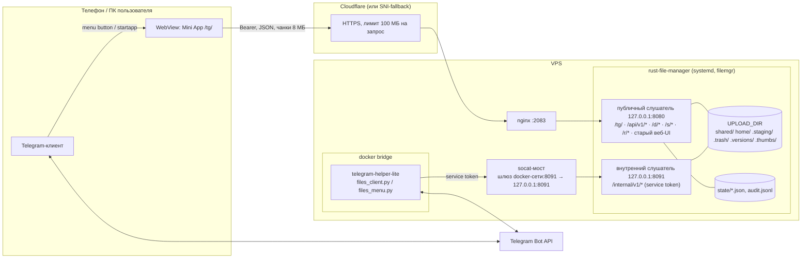

# План: Telegram Mini App «Файлы» для rust-file-manager

**Статус:** проект, реализация не начата · **Дата:** 07.10.2026
**Версии на момент плана:** rust-file-manager 1.4.0, TelegramOnly 3.24.0;
каждый этап ниже выходит следующим минорным выпуском обоих проектов.
**Затрагивает:** `rust-file-manager` (основная часть) и `TelegramOnly` (бот:
кнопка запуска, приём/отправка файлов, уведомления). Бот-часть подробно —
в `TelegramOnly/FILES_MINIAPP_PLAN.md`.
**Макет интерфейса:** [design/miniapp-mockup.html](design/miniapp-mockup.html) —
интерактивный, открывается в браузере, светлая/тёмная тема Telegram.

В документации используются `files.example.com`, `@files_example_bot` и
зарезервированные адреса. Рабочие домены, IP и ключи в репозиторий не
вносятся.

### Решения владельца (07.10.2026)

| Вопрос | Решение | Где в плане |
|---|---|---|
| Подпапки внутри категорий | **Нужны.** Модель путей с папками закладывается с этапа 1, управление папками — этап 2 | §6.10, §7, §11 |
| Публичные ссылки для людей без аккаунта | **Нужны** — на файлы и на папки, со страницей для получателя и ZIP | §6.7, §11 этап 3 |
| Кнопка «Файлы» вместо кнопки списка команд | **Всем привязанным пользователям, включая админов.** Подсказки команд по «/» сохраняются | §9, `TelegramOnly/FILES_MINIAPP_PLAN.md` §3.4 |
| Локальный сервер Bot API | Открыт: объяснение и рекомендация — §13 | §13 |

---

## 0. Коротко

Пользователь открывает бота, нажимает **«📂 Файлы»** рядом с полем ввода — и
внутри Telegram открывается полноценный файловый менеджер: без пароля
(вход по подписи Telegram), в цветах темы Telegram, с загрузкой больших
файлов с докачкой, просмотром фото/видео/текста, редактором, корзиной,
ссылками для обмена и отправкой файлов в любой чат.

| Решение | Выбор | Почему |
|---|---|---|
| Где бэкенд мини-приложения | **В самом rust-file-manager** (`/tg/`, `/api/v1/*`) | Один источник прав доступа и путей, файлы не гоняются через Python-контейнер, стриминг и Range — в Rust |
| Вход | **`initData` + проверка подписи Ed25519** (поле `signature`) | Файловому менеджеру **не нужен `BOT_TOKEN`**: компрометация FM не отдаёт управление админ-ботом VPN-инфраструктуры |
| Сессия в WebView | **Bearer-токен в памяти**, не cookie | В web.telegram.org мини-приложение живёт в iframe — сторонние cookie и `SameSite=Strict` там не работают |
| Загрузка | **Своя резюмируемая загрузка частями** по 8 МБ | Обходит лимит Cloudflare 100 МБ на запрос, переживает обрывы мобильной сети |
| Скачивание | **Подписанные короткоживущие URL** `/d/…` + `WebApp.downloadFile` | ``, `<video>` и нативный загрузчик Telegram не умеют слать заголовок авторизации |
| Фронтенд | **Preact + htm без сборки**, файлы вшиваются в бинарник | Сохраняется «один бинарник без Node на VPS»; компонентная модель для ~14 экранов; ~15 КБ библиотек |
| Связь бот ↔ FM | **Внутренний API** FM на отдельном порту + socat-мост на шлюз docker-сети (как у BotCriptoM) + long-poll событий | Один канал, одна точка аутентификации (service token), бот не открывает новых входящих эндпоинтов |
| Хранение метаданных | JSON-хранилища по образцу `users.json` (RwLock + атомарная запись) | Без БД, в духе проекта; масштаб — семья/команда |
| Папки | **Обычные подкаталоги внутри категорий**, путь `зона/категория/папка/…/файл`, глубина до 8 | Файлы остаются обычными файлами на диске; старые ссылки на файлы в корне категории продолжают работать |

Оценка объёма: **≈ 24–35 рабочих дней** на этапы 0–3 (MVP → просмотр,
редактор и папки → обмен и передача через бота), этап 4 — по желанию.

---

## 1. Сценарии (что должно стать возможным)

**Доступ**
1. Открыть файлы из бота одной кнопкой (menu button, команда `/files`,
   ссылка `t.me/files_example_bot?startapp`), без ввода пароля.
2. Привязать существующий аккаунт FM к Telegram один раз (логин + пароль),
   либо зарегистрироваться по приглашению, присланному в Telegram.

**Загрузка (на сервер)**
3. Выбрать несколько фото/видео/документов на телефоне или компьютере,
   снять фото камерой, вставить из буфера, перетащить (Desktop/Web).
4. Загрузить файл в сотни мегабайт — с прогрессом, скоростью, оставшимся
   временем и **докачкой** после обрыва или повторного выбора того же файла.
5. Отправить файл боту прямо в чат → он сохранится в «Мои» или «Общие».
6. Получить файлы от человека без аккаунта по ссылке «Запрос файлов».

**Скачивание и передача (с сервера)**
7. Скачать файл нативным диалогом Telegram (`downloadFile`), несколько
   файлов — одним ZIP.
8. Отправить файл себе в чат с ботом (дальше его можно переслать куда
   угодно), до 50 МБ — самим файлом, больше — временной ссылкой.
9. Поделиться в любой чат Telegram карточкой файла с кнопкой «Скачать».
10. Создать публичную ссылку на файл или папку для человека без аккаунта:
    срок жизни, пароль, лимит скачиваний, уведомление о скачивании, QR-код;
    отозвать в любой момент.
11. Поделиться с другим участником — файл появится у него во «Входящих»,
    бот пришлёт уведомление.

**Работа с файлами**
12. Просмотр: галерея фото со свайпами, видео/аудио со стримингом и
    перемоткой, текст и код, Markdown, PDF (во внешнем просмотрщике,
    позже — встроенный).
13. Редактирование текстовых файлов и конфигов прямо в Telegram, с
    защитой от одновременной правки и историей версий.
14. Переименование, перемещение между категориями и зонами, копирование,
    избранное, недавние, поиск по всем зонам, массовые операции.
15. Корзина с восстановлением (30 дней) вместо немедленного удаления.
16. Свои папки внутри категорий: создать, переименовать, переместить,
    удалить в корзину; загрузить папку целиком с компьютера (Telegram
    Desktop/Web) с сохранением структуры; поделиться папкой.

**Администрирование**
17. Участники: занятое место, привязка Telegram, приглашения через Telegram,
    удаление; состояние сервера (диск, версия, аптайм); журнал действий;
    все активные ссылки с возможностью отзыва.

---

## 2. Исходное состояние и ограничения

### rust-file-manager 1.4.0
- Actix Web 4, HTML-шаблоны со встроенными CSS/JS (`include_str!`),
  один бинарник, systemd-служба `rust-file-manager`, пользователь `filemgr`,
  `127.0.0.1:8080` за nginx.
- Вход по логину/паролю, cookie-сессии (`SameSite=Strict`, `HttpOnly`, TTL 12 ч).
- Зоны: `shared/` и `home/<user>/`; фиксированные категории
  (`Фото`, `Документы`, `Программы`, `Видео`, `Другие`, `Бэкапы/{Серверы,HA,Project}`).
  Адрес файла — `(зона, категория, имя)`; ID у файлов нет.
- Маршруты: `GET /`, `GET /uploads/{scope}/{category}/{file}` (только
  `attachment`), `POST /upload/{scope}` (multipart, целиком),
  `POST /rename/…`, `DELETE /delete/…`, `/admin/invites`, `/admin/users/{u}`.
- Проверки путей: `category_rel_dir` (белый список), `sanitize_file_name`,
  `PendingUpload` (резервирование имени `create_new`, удаление недокачанного).
- В дереве зависимостей уже есть `hmac`, `sha2`, `hkdf`, `subtle`,
  `serde_urlencoded`, `mime_guess` (через `cookie`/`actix-*`).

### TelegramOnly 3.24.0 (бот)
- python-telegram-bot 22, long-polling, контейнер `telegram-helper-lite`
  в bridge-сети compose; REST API на `127.0.0.1:8000`.
- Доступ к сервисам хоста из контейнера — **только через socat-мосты на
  шлюзе docker-сети** (`172.18.0.1` на одном хосте, `172.20.0.1` на другом;
  см. `DEPLOY.md` §8.9). `network_mode: host` не подходит (sysctl-обход PMTU).
- Inline-режим уже занят калькулятором сделки (`desk_inline_query`, только
  админ) — нужен маршрутизатор по префиксу запроса.
- `MenuButtonCommands` выставляется по умолчанию для всех чатов.
- `JobQueue` не установлен — фоновые задачи через `asyncio`.

### Инфраструктура
- **443/TCP занят** VLESS-Reality (Xray). HTTPS для FM идёт через Cloudflare →
  nginx на 2083 (`GUIDE_cloudflare.md`) или через Xray fallback → nginx SNI.
- **Cloudflare Free режет тело запроса 100 МБ** → нужна загрузка частями.
- **VPS с ~1 ГБ RAM и 1 ГБ swap**: нельзя держать файлы в памяти, тяжёлые
  операции (миниатюры, ZIP) — строго потоково и с ограничением параллелизма.
- Mini App обязан открываться по **HTTPS с валидным сертификатом**
  (сертификат Cloudflare на краю подходит).

---

## 3. Архитектура



### Почему бэкенд в Rust, а не в боте

| Вариант | Плюсы | Минусы |
|---|---|---|
| **A. API и фронтенд в rust-file-manager** (выбран) | Одна модель прав и путей; стриминг/Range из коробки (`NamedFile`); файлы не проходят через Python; веб-UI и мини-приложение видят одно и то же | Больше работы в Rust; фронтенд вшивается в бинарник |
| B. Бэкенд в FastAPI бота, проксирование в FM | Привычный Python | Двойной хоп для гигабайтных файлов в контейнере на 1 ГБ RAM; дублирование авторизации; бот получает доступ к файлам |
| C. Отдельный сервис-шлюз | Изоляция | Третий процесс, третья конфигурация — избыточно для масштаба проекта |

### Потоки данных
- **Мини-приложение ↔ FM** — только публичный API по HTTPS, Bearer-токен.
- **Бот → FM** — внутренний API (приём файлов из чата, отправка файлов в чат,
  приглашения, статус, long-poll событий). FM **никогда не ходит к боту** и не
  знает `BOT_TOKEN`.
- **FM → пользователь в Telegram** — через события: FM кладёт событие в
  очередь, бот забирает long-poll'ом и отправляет сообщение.

---

## 4. Аутентификация и привязка аккаунтов

### 4.1. Проверка `initData` без токена бота

Telegram передаёт в мини-приложение подписанную строку `initData`
(`user`, `auth_date`, `start_param`, `hash`, `signature`, …). С Bot API 8.0
в ней есть поле **`signature`** — подпись Ed25519 ключом Telegram, которую
третья сторона проверяет, зная только **числовой ID бота**:

```
data_check_string = "<bot_id>:WebAppData\n" +
                    join("\n", sorted("key=value" для всех полей, кроме hash и signature))
verify_ed25519(telegram_public_key, data_check_string, base64url_decode(signature))
```

Публичные ключи Telegram (сверить с разделом «Validating data for
Third-Party Use» документации перед внедрением):
- production: `e7bf03a2fa4602af4580703d88dda5bb59f32ed8b02a56c187fe7d34caed242d`
- test environment: `40055058a4ee38156a06562e52eece92a771bcd8346a8c4615cb7376eddf72ec`

Дополнительно: `now − auth_date ≤ TG_INIT_DATA_MAX_AGE` (по умолчанию 1 ч),
`user.id` присутствует, `initData` **никогда не пишется в логи**.

> Альтернатива — классическая HMAC-проверка
> (`secret = HMAC_SHA256("WebAppData", BOT_TOKEN)`), не требует новых крейтов,
> но кладёт `BOT_TOKEN` в `/etc/rust-file-manager/env`. Оставляем её только
> как резервный режим за флагом `TG_AUTH_MODE=hmac` для старых клиентов без
> `signature`; по умолчанию — `ed25519`.

Новая зависимость: `ed25519-dalek` (только проверка подписи, `default-features = false`).

### 4.2. Сессия мини-приложения

1. Клиент: `POST /api/v1/tg/session { init_data }`.
2. Сервер проверяет подпись, находит аккаунт по `telegram_id`.
3. Ответ: `access_token` (stateless, HMAC-подпись ключом из HKDF от
   `SESSION_SECRET`, info `rfm/v1/access`), TTL = 12 ч как у веб-сессии,
   полезная нагрузка `{u, tg, tv, iat, exp}`.
4. Токен хранится **только в памяти** страницы. При закрытии мини-приложения
   он пропадает — при следующем открытии Telegram выдаёт свежий `initData`.
5. Отзыв: у пользователя поле `token_version` (`tv`); «Выйти на всех
   устройствах», отвязка Telegram и удаление аккаунта увеличивают его —
   все выданные токены и подписанные URL перестают работать. Middleware,
   как и сейчас `require_auth`, проверяет, что пользователь существует.

Если аккаунт не найден — `403 { code: "not_linked" }` и экран привязки.

### 4.3. Три способа привязки

| Способ | Как | Для кого |
|---|---|---|
| **Логин + пароль один раз** | Экран «Привязать аккаунт» в мини-приложении → `POST /api/v1/tg/link { init_data, username, password }` | Существующие пользователи и сам админ |
| **Приглашение через Telegram** | Админ: `/files_invite` в боте или кнопка в мини-приложении → ссылка `t.me/files_example_bot?startapp=inv_<token>` → получатель открывает → `POST /api/v1/tg/register { init_data, invite_token, username }` | Новые люди; пароль не нужен, его можно задать позже для входа из браузера |
| **Админ вручную** | `/files_bind <tg_id> <username>` в боте (через внутренний API) | Аварийный путь |

Правила:
- Один `telegram_id` ↔ один аккаунт. Перепривязка — только после отвязки
  (сам пользователь в настройках или админ).
- Попытки `link` ограничены: 5 за 15 минут на `telegram_id` и на IP
  (in-memory token bucket, без нового крейта).
- `start_param` берётся **из подписанного `initData`**, а не из URL —
  его нельзя подменить.
- Аккаунты, созданные из Telegram, получают недействительный хэш пароля
  (`!`): вход в браузере невозможен, пока пользователь не задаст пароль.
- Админ FM (из `ADMIN_USERNAME`) хранит привязку в `users.json` в новом
  разделе `admin_profile { telegram_id, token_version }`.

---

## 5. Интерфейс мини-приложения

Полный интерактивный макет: [design/miniapp-mockup.html](design/miniapp-mockup.html).

### 5.1. Принципы

- **Нативность.** Цвета — из `themeParams` Telegram (CSS-переменные
  `--tg-theme-*`), реакция на `themeChanged`; системный шрифт платформы;
  размеры строк и отступы как в настройках Telegram. Мини-приложение
  выглядит частью клиента, а не встроенным сайтом.
- **Нижние кнопки Telegram вместо своих.** Главное действие экрана —
  `MainButton` («Загрузить», «Сохранить», «Создать ссылку»), второе —
  `SecondaryButton`; назад — `BackButton`; настройки — `SettingsButton`.
- **Тактильность.** `HapticFeedback`: `selectionChanged` на чипах и
  переключателях, `impactOccurred('light')` на открытии листа,
  `notificationOccurred('success'|'error')` по итогам операций.
- **Нативные подтверждения.** Удаление, перезапись, отзыв ссылки —
  `showConfirm`/`showPopup` с кнопкой `destructive`.
- **Никаких тупиков.** Каждый пустой экран объясняет, что здесь появится и
  как это сделать; каждая ошибка говорит, что случилось и что нажать.
- **Цвет — это тип файла.** Акцент интерфейса — цвет кнопки Telegram;
  дополнительно у каждой категории свой спокойный цвет плитки:

  | Категория | Цвет плитки | Значок |
  |---|---|---|
  | Фото | фиолетовый `#9b5de5` | image |
  | Документы | синий `#3a86ff` | file-text |
  | Видео | розово-красный `#ef476f` | film |
  | Программы | зелёный `#2fbf71` | package |
  | Бэкапы | янтарный `#f4a261` | archive |
  | Другие | серо-голубой `#8d99ae` | file |

### 5.2. Используемые возможности Telegram Web Apps

| Возможность | Мин. версия Bot API | Где используется |
|---|---|---|
| `themeParams`, `themeChanged`, `setHeaderColor`, `setBackgroundColor` | 6.1 | Тема, цвет шапки под экран |
| `BackButton`, `MainButton`, `HapticFeedback` | 6.1 | Навигация, главные действия, отклик |
| `showPopup`, `showConfirm`, `showAlert` | 6.2 | Подтверждения |
| `showScanQrPopup` | 6.4 | Сканирование QR (вход на ПК, чужая ссылка) |
| `switchInlineQuery(query, chooseChatTypes)` | 6.7 | «Отправить в чат…» карточкой файла |
| `CloudStorage` | 6.9 | Вид списка, сортировка, последняя зона — синхронно между устройствами |
| `requestWriteAccess` | 6.9 | Разрешение боту писать (уведомления), если открыто по ссылке |
| `SettingsButton` | 7.0 | Пункт «Настройки» в меню ⋯ |
| `BiometricManager` | 7.2 | Этап 4: замок на «Мои файлы» |
| `disableVerticalSwipes` | 7.7 | Галерея и редактор не закрывают приложение свайпом |
| `SecondaryButton`, `setBottomBarColor` | 7.10 | «Отмена»/«Сохранить как копию» |
| `downloadFile`, `requestFullscreen`, `safeAreaInset`, `contentSafeAreaInset`, `addToHomeScreen`, `shareMessage` | 8.0 | Скачивание, полноэкранный просмотр, ярлык, шаринг |
| `DeviceStorage`, `SecureStorage` | 9.0 | Черновики редактора, отпечатки незавершённых загрузок |
| `enableClosingConfirmation` | 6.2 | Пока идёт загрузка или есть несохранённые правки |

Каждая возможность включается через `WebApp.isVersionAtLeast()`; на старых
клиентах — понятная деградация (например, `openLink` вместо `downloadFile`).

### 5.3. Карта экранов

```
Главная ─┬─ Мои файлы ─┐
         ├─ Общие ─────┼─ Категория › папка › … (список/сетка) ─ Карточка файла ─┬─ Просмотр (фото/видео/аудио/текст/MD)
         ├─ Входящие   │                                           ├─ Редактор
         ├─ Избранное  │                                           ├─ Поделиться ─ Ссылка / Участнику / В чат
         ├─ Недавние   │                                           ├─ Переместить / Копировать
         ├─ Поиск ─────┘                                           └─ Версии
         ├─ Загрузки (очередь)
         ├─ Мои ссылки и запросы файлов
         ├─ Корзина
         ├─ Настройки (SettingsButton)
         └─ Администрирование (только админ)
Привязка аккаунта / Регистрация по приглашению — до входа
```

Навигация — стек экранов в памяти, синхронизированный с `BackButton`
(без hash-роутинга: Telegram сам кладёт параметры запуска в `location.hash`).
Глубокие ссылки — через `start_param`: `inv_<token>`, `upload`,
`f_<ref>` (открыть файл или папку), `links`, `req_<id>`, `login_<nonce>`.

### 5.4. Экраны

**Главная.** Приветствие с аватаром Telegram; кольца занятого места
(«Мои» / «Общие» / свободно на диске для админа); ряд быстрых действий
(Загрузить · Камера · Запросить файлы · Сканировать QR); плитки разделов
со счётчиками (Мои, Общие, Входящие, Избранное, Недавние, Ссылки, Корзина);
карусель недавних файлов с миниатюрами; плашка активных загрузок.
`MainButton`: «Загрузить файлы».

**Категория.** Переключатель «Мои / Общие»; чипы категорий со счётчиками
(`Все 198 · Фото 128 · Документы 46 · …`, «Бэкапы ▸» раскрывает папки);
поиск с подсветкой совпадения; сортировка (имя/размер/дата, ↑↓); вид
список/сетка (сетка по умолчанию для «Фото» и «Видео»). Строка файла:
плитка типа или миниатюра, имя в две строки с переносом, «2,4 МБ · вчера,
18:40», значки «🔗 ссылка» и «★». Долгое нажатие — режим выбора с нижней
панелью: «Скачать ZIP · Переместить · Поделиться · В корзину».
Подгрузка страницами по 100, скелетоны при загрузке, «потяни, чтобы
обновить».

**Папки.** Внутри категории сначала идут папки (плитка в цвете категории,
«12 файлов · 46 МБ»), затем файлы. Внутри папки — строка «хлебных крошек»
(`Документы › Ремонт кухни › Чеки`), каждое звено кликабельно; `BackButton`
поднимается на уровень выше. Кнопка «+ Папка» создаёт папку в текущем
месте; действия над папкой — тот же нижний лист, что у файла (Поделиться,
Переименовать, Переместить, Скачать ZIP, В корзину). Поиск ищет и по
именам папок, в результатах показан путь.

**Карточка файла** (нижний лист). Крупное превью, имя, метаданные (размер,
дата, зона и категория, кто загрузил); сетка действий: Открыть, Скачать,
Отправить мне в чат, Поделиться, Переименовать, Переместить, Копировать в
«Общие»/«Мои», В избранное, Версии, В корзину. Недоступное (например,
«Редактировать» для бинарного файла) не показывается.

**Просмотр.** Фото — полноэкранная галерея (`requestFullscreen`), свайп
влево/вправо, pinch-zoom, двойной тап, счётчик «3 / 128», нижняя панель
(Поделиться, Скачать, Инфо, В корзину). Видео/аудио — нативный плеер по
подписанному URL с Range, плейлист для аудио в категории. Текст/код —
моноширинный просмотр с номерами строк и кнопкой «Изменить». Markdown —
отрисовка в `iframe sandbox` без скриптов. PDF — «Открыть» через
`openLink(signed_url)` (этап 4 — встроенный pdf.js по требованию).

**Редактор.** Шапка: имя файла, индикатор «изменён»; панель: Найти и
заменить, Перенос строк, Размер шрифта, Отменить/Повторить; поле с номерами
строк, табуляцией и автоотступом. `MainButton` «Сохранить» (активна при
изменениях), `SecondaryButton` «Отменить правки». Черновик
автосохраняется в `DeviceStorage`; при закрытии с правками —
`enableClosingConfirmation`. Конфликт (файл изменили параллельно) — лист
«Перезаписать / Сохранить как копию / Показать изменения».
Ограничения: UTF-8, до `EDITOR_MAX_KB` (по умолчанию 1024 КБ).

**Загрузки.** Куда: «Мои/Общие» + категория и папка (по умолчанию — авто
по расширению в корень категории; при загрузке из открытой папки — в неё);
на Desktop/Web — «Загрузить папку» со структурой подкаталогов; переключатель «Сжимать фото до 2560 px»; список файлов с
прогрессом, скоростью и «осталось ~1 мин», состояния «ожидает / загружается /
готово ✓ / ошибка — Повторить». Подсказка: «Можно свернуть Telegram на
несколько секунд; если загрузка прервётся, выберите тот же файл снова —
она продолжится с места остановки».

**Поделиться** (нижний лист, три вкладки).
- *Ссылка:* срок (1 час · 1 день · 7 дней · 30 дней · без срока), пароль,
  лимит скачиваний, «только просмотр в браузере», «сообщить о скачивании»;
  готовая ссылка с кнопкой копирования и QR-код.
- *Участнику:* выбор участника из списка → появится у него во «Входящих»,
  бот пришлёт уведомление.
- *В Telegram:* «Выбрать чат…» (`switchInlineQuery` → карточка с кнопкой
  «Скачать»), «Отправить мне в чат с ботом».

**Публичная страница ссылки** (браузер получателя, не Telegram). Фирменный
стиль файлового менеджера, светлая/тёмная тема по настройке системы.
Файл: имя, размер, превью (если разрешено), «Скачать». Папка: «Анна
поделилась папкой «Ремонт кухни»», список файлов и подпапок с переходами
внутри общей папки, «Скачать всё (ZIP)». Пароль — отдельный экран «Ссылка
защищена паролем». Внизу — срок действия и остаток скачиваний.

**Мои ссылки и запросы.** Активные ссылки: файл или папка, срок, «скачано 3 из 10»,
переключатель активности, «Отозвать». Запросы файлов: название, папка
назначения, «получено 4 файла», ссылка, QR, «Закрыть приём».

**Корзина.** Файлы с «удалится через 27 дн.», «Восстановить», «Удалить
навсегда», «Очистить корзину» с подтверждением; отдельные вкладки «Мои» и
«Общие».

**Настройки.** Уведомления (новые файлы в «Общих» — сводкой, скачивания по
моим ссылкам, загрузки по запросам, входящие от участников); зона и
категория загрузки по умолчанию; сжатие фото; вид по умолчанию; пароль для
входа из браузера; «Выйти на всех устройствах»; «Отвязать Telegram»;
версия приложения и сервера.

**Администрирование.** Участники (занятое место полосой, привязан ли
Telegram, последний вход; «Пригласить через Telegram», «Отвязать»,
«Удалить»); сервер (свободно на диске, версия/коммит, аптайм, размер
корзины и staging); все активные ссылки с отзывом; журнал действий с
фильтрами.

**Привязка/регистрация.** Карточка «Это ваш Telegram: @name» + два пути:
«У меня есть аккаунт» (логин/пароль) и «У меня есть приглашение» (поле или
автоматически из `start_param`). Объяснение, зачем это нужно, в одном
предложении.

### 5.5. Визуальная система

- **Токены** — только переменные Telegram + производные:
  `--bg: var(--tg-theme-bg-color)`, `--surface: var(--tg-theme-section-bg-color)`,
  `--surface-2: var(--tg-theme-secondary-bg-color)`, `--text`, `--hint`,
  `--link`, `--accent: var(--tg-theme-button-color)`,
  `--accent-text: var(--tg-theme-button-text-color)`,
  `--danger: var(--tg-theme-destructive-text-color)`,
  `--separator: var(--tg-theme-section-separator-color)`; запасные значения
  на случай открытия вне Telegram.
- **Сетка:** боковые поля 16 px; секции-«острова» с радиусом 12 px на
  `--surface-2`; строка списка 56 px (плитка 40×40, радиус 10 px); строка
  настроек 48 px; заголовки секций — 13 px, капс, разрядка 0.4 px, цвет
  `section_header_text`.
- **Типографика:** системный шрифт; 17/22 заголовок экрана, 15/20 строка,
  13/16 метаданные, `tabular-nums` для размеров и процентов; моноширинный
  `ui-monospace` в редакторе.
- **Движение:** нижние листы 240 мс `cubic-bezier(.2,.8,.2,1)`, нажатие
  строки — `scale(.98)` 90 мс, прогресс — плавная анимация ширины;
  всё отключается при `prefers-reduced-motion`.
- **Иконки:** встроенный SVG-спрайт (подмножество Lucide, лицензия ISC,
  вендорится с LICENSE), 22 px, штрих 1.75.
- **Доступность:** контраст по WCAG AA в обеих темах; сенсорные цели
  ≥ 44 px; `aria-label` у кнопок-иконок; видимый фокус для клавиатуры
  (Telegram Desktop/Web); имена файлов только через `textContent`.
- **Ширины:** от 320 px (маленькие Android) до окна Telegram Desktop;
  на ширине ≥ 720 px — двухколоночный режим «список + карточка».

---

## 6. Функции: устройство

### 6.1. Загрузка частями с докачкой

Свой простой протокол (по смыслу как tus, но без лишнего):

```
POST   /api/v1/uploads            {scope, category?, path?, name, size, mtime?, sha256?}
       → 201 {id, chunk_size, offset: 0, expires_at}
PUT    /api/v1/uploads/{id}       Upload-Offset: N, тело: сырые байты (≤ chunk_size)
       → 200 {offset: N+len}  |  409 {offset: <фактический>}
GET    /api/v1/uploads/{id}       → {offset, size, name, expires_at}
POST   /api/v1/uploads/{id}/complete → 200 {file: FileItem}
DELETE /api/v1/uploads/{id}       → 204
```

- **Staging** — `UPLOAD_DIR/.staging/<user>/<id>.part` (та же ФС →
  атомарный `rename`) + `<id>.json` с метаданными. Чанк дописывается
  `pwrite` по смещению только если `Upload-Offset == текущий размер`;
  иначе 409 с фактическим смещением — клиент продолжает с него.
- **Завершение**: проверка размера (и `sha256`, если передан), выбор итогового
  имени той же логикой, что `PendingUpload::create` (`create_new`, суффиксы
  `(1)`, `(2)`), переименование `.part` → итоговый путь, запись в аудит,
  событие `file.uploaded`.
- **Лимиты**: `MAX_FILE_SIZE_MB` для старой загрузки остаётся;
  для частичной — `MAX_CHUNKED_FILE_SIZE_MB` (по умолчанию 4096);
  `UPLOAD_CHUNK_SIZE_MB` = 8; не более 4 незавершённых загрузок на
  пользователя; общий объём staging на пользователя ≤ лимита файла × 2;
  `ENOSPC` → `507 Недостаточно места на сервере`.
- **Уборка**: фоновая задача раз в час удаляет staging старше 24 ч.
- **Клиент**: очередь (2 файла параллельно, части последовательно), повтор с
  экспоненциальной паузой (1, 2, 4, 8, 16 с) и учётом `navigator.onLine`;
  отпечаток незавершённой загрузки `{name, size, lastModified} → upload_id`
  хранится в `DeviceStorage`/`localStorage` — при повторном выборе того же
  файла загрузка продолжается с сервера. Объект `File` между запусками
  WebView не сохраняется — это ограничение платформы, его честно объясняем.
- **Загрузка папки** (Telegram Desktop/Web, `<input webkitdirectory>` и
  перетаскивание): каждый файл — отдельная загрузка с `path` = его
  относительный каталог; недостающие подпапки создаются на сервере при
  завершении; глубина и имена проверяются так же, как в §6.10.
- **Сжатие фото** (по желанию): клиентский `canvas` → JPEG 85 %, длинная
  сторона 2560 px; оригинал не трогается, если опция выключена.

### 6.2. Скачивание и стриминг

- `POST /api/v1/files/{id}/link {purpose: download|inline|stream}` →
  подписанный URL `/d/<payload>.<sig>`:
  `payload = base64url({v:1, u, tv, path, exp, disp})`,
  `sig = HMAC-SHA256(HKDF(SESSION_SECRET, "rfm/v1/url"), payload)`.
  TTL: 5 мин для `download`, 6 ч для `stream`/`inline`.
- Сервер проверяет подпись (`subtle`, постоянное время), срок, что
  пользователь существует и `tv` совпадает, затем повторно прогоняет путь
  через `safe_path`. Отдача — `NamedFile` с Range, `ETag`, `Last-Modified`.
- `inline` разрешён только для безопасных типов (`image/jpeg|png|webp|gif`,
  `video/mp4|webm`, `audio/*`) + `X-Content-Type-Options: nosniff`.
  **SVG и HTML — всегда `attachment`** (как сейчас).
- `WebApp.downloadFile({url, file_name})` — нативный диалог. Для
  web.telegram.org ответ `/d/` несёт `Access-Control-Allow-Origin:
  https://web.telegram.org` и `Content-Disposition: attachment; filename*=…`.
  На старых клиентах — `openLink(url)` во внешний браузер.
- **ZIP** (этап 4): `POST /api/v1/zip {items}` → подписанный `/d/zip/…`,
  архив собирается потоково без сжатия (`STORE`), чтобы не грузить CPU;
  ограничение — 2 одновременных архива на сервер.

### 6.3. Миниатюры (с учётом 1 ГБ RAM)

Гибридная схема без тяжёлой обработки на сервере:
- **Клиент генерирует** миниатюру при загрузке (`canvas`, 320 px, JPEG ≤ 64 КБ;
  для видео — кадр на 1-й секунде) и отправляет
  `PUT /api/v1/files/{id}/thumb`. Сервер проверяет сигнатуру JPEG/WebP и
  размер, хранит в `UPLOAD_DIR/.thumbs/<sha256(путь)>.jpg`.
- **Бот** при сохранении фото из чата кладёт готовую миниатюру Telegram
  (минимальный `PhotoSize`).
- **Нет миниатюры** — плитка с цветом и значком типа; ленивое создание
  миниатюры, когда клиент первый раз открывает фото в просмотре.
- Этап 4: необязательная серверная генерация за cargo-фичей `thumbnails`
  (`image` с jpeg/png/webp), семафор = 1, лимит декодирования 24 Мпикс и
  128 МБ — для хостов с запасом памяти.

### 6.4. Редактор и версии

- `GET /api/v1/files/{id}/content` → текст + `ETag` (sha256 содержимого).
- `PUT /api/v1/files/{id}/content` с `If-Match` → при несовпадении 412 и
  лист конфликта. Запись атомарная: временный файл в том же каталоге →
  `fsync` → `rename`.
- Перед перезаписью старая версия копируется в
  `UPLOAD_DIR/.versions/<sha256(путь)>/<unix_ts>`; хранится 10 последних
  версий и не более 50 МБ на файл. `GET …/versions`,
  `POST …/versions/{ts}/restore` (текущая при этом тоже становится версией).
- `POST /api/v1/text {scope, category, name}` — «Новая заметка».
- Только UTF-8; бинарное содержимое (NUL-байты в первых 8 КБ) — «Этот файл
  нельзя редактировать как текст».

### 6.5. Корзина

- Удаление из мини-приложения = перемещение в
  `UPLOAD_DIR/.trash/<zone-key>/<id>` + запись в `state/trash.json`
  (`{id, zone, category, name, size, deleted_by, deleted_at}`).
- Папка уходит в корзину целиком (одна запись, `kind: folder`, размер и
  число файлов); восстанавливается вместе с содержимым.
- Восстановление — в исходное место; занято имя → суффикс `(1)`; если
  родительской папки уже нет, она создаётся заново.
- Корзина «Мои» видна владельцу, корзина «Общие» — всем участникам
  (как и сама зона); «Очистить навсегда» в «Общих» — только админ.
- Автоочистка через `TRASH_RETENTION_DAYS` (по умолчанию 30).
- Старый веб-UI переходит на ту же корзину (поведение `DELETE /delete/…`
  меняется — **это изменение публичного маршрута**, отметить в CHANGELOG;
  совместимость: ответ тот же `{success, message}`).

### 6.6. Перемещение, копирование, избранное, поиск

- `POST /api/v1/files/batch {op: move|copy|delete|favorite|unfavorite,
  items, target?, on_conflict: rename|skip|fail}` — до 200 элементов,
  результат по каждому.
- Перемещение в пределах `UPLOAD_DIR` — `rename` (атомарно), и для файлов,
  и для папок; папку нельзя переместить внутрь неё самой; копирование —
  потоковое, с резервированием имени через `create_new`, для папки —
  рекурсивно с лимитом (по умолчанию 2 ГБ и 5000 файлов за операцию).
- Ссылки и избранное, указывающие на файл, обновляются при переименовании и
  перемещении из приложения (под одной блокировкой состояния). Изменения
  по SSH ссылки не отслеживают — ссылка покажет «Файл недоступен».
- Поиск `GET /api/v1/files?q=` по всем доступным зонам: подстрока без учёта
  регистра (Unicode), фильтры тип/размер/дата, до 200 результатов.
- Недавние — 30 последних изменённых файлов по `mtime`.

### 6.7. Обмен

**Публичные ссылки** `/s/<token>` (токен 256 бит) — на файл или на папку:
- Ссылка на папку открывает только её содержимое: переходы внутрь
  подпапок разрешены, выше корня ссылки — нет (путь из запроса
  проверяется так же, как в §6.10, относительно папки ссылки). Скачивание
  отдельных файлов и всей папки одним ZIP (потоково, без сжатия).
- Параметры: `expires_at`, пароль (bcrypt), `max_downloads`,
  `allow_preview`, `notify_owner`.
- Страница ссылки — лёгкий HTML: имя, размер, тип, кнопка «Скачать»,
  поле пароля при необходимости; превью только для безопасных типов.
- Заголовки: `Referrer-Policy: no-referrer`, `X-Robots-Tag: noindex`,
  `Cache-Control: private, no-store`, строгий CSP, `nosniff`.
- Пароль: 5 попыток за 15 минут на ссылку и IP; после ввода — короткий
  подписанный токен разблокировки на 1 ч.
- Счётчики скачиваний копятся в памяти и сбрасываются на диск раз в 30 с
  (без записи JSON на каждый запрос).
- Удаление файла или папки, владельца или истечение срока делают ссылку
  недействительной («Ссылка больше не работает»). Перемещение и
  переименование из приложения ссылку сохраняют (она обновляется).
- Лимит скачиваний для папки считает скачивания ZIP и отдельных файлов;
  просмотр списка и превью не считаются.

**Запросы файлов** `/r/<token>`: страница «Загрузите файлы для <имя>»
(в выбранную папку владельца),
приём тем же протоколом частями (авторизация — токеном запроса); лимиты
числа файлов, размера, срока; файлы ложатся в выбранную папку владельца;
каждое поступление — уведомление владельцу в Telegram.

**Участнику**: запись в `state/shares.json` `{from, to, path}`; у
получателя раздел «Входящие» (только чтение и «Сохранить себе»), бот
присылает «@alice поделилась файлом report.pdf» с кнопкой «Открыть».

**В Telegram**:
- *Себе в чат* — `POST /api/v1/files/{id}/send-to-chat` → событие для бота →
  бот берёт поток из внутреннего API и отправляет документ (≤ 50 МБ через
  облачный Bot API; больше — сообщение с временной ссылкой на 24 ч и
  кнопкой «Открыть в Файлах»). Статус отправки возвращается в приложение.
- *В любой чат* — мини-приложение создаёт ссылку и вызывает
  `switchInlineQuery("fs <share_id>", ["users","groups","channels"])`;
  бот в inline-режиме отвечает карточкой «📄 report.pdf · 2,4 МБ» с кнопкой
  «⬇️ Скачать». Этап 4: `shareMessage` через `savePreparedInlineMessage` и
  отправка самого файла (`InlineQueryResultCachedDocument`).
- **QR-код** ссылки рисуется на клиенте (вендорный генератор QR, MIT).

### 6.8. Уведомления через бота

FM складывает события в кольцевой буфер в памяти (последние 1000) плюс
незавершённые задания для бота — в `state/jobs.json`. Бот забирает их
long-poll'ом `GET /internal/v1/events?after=<id>&wait=25` и подтверждает
`POST /internal/v1/events/{id}/ack`.

| Событие | Кому | Сообщение |
|---|---|---|
| `job.send_document` | инициатору | сам файл или ссылка |
| `share.downloaded` | владельцу ссылки (если включено) | «По ссылке на report.pdf скачали файл (2 из 10)» |
| `request.uploaded` | владельцу запроса | «В запрос "Документы для визы" загружено: passport.pdf» |
| `share.user` | получателю | «@alice поделилась: report.pdf» |
| `shared.digest` | подписанным | раз в час: «В Общих 5 новых файлов» |
| `invite.accepted` | пригласившему | «@bob зарегистрировался по приглашению» |
| `storage.low` | админам | «На диске осталось 1,2 ГБ (5 %)» |

Каждое сообщение — с кнопкой `web_app` «Открыть», ведущей в нужное место
(`?open=<ref>`). Настройки уведомлений хранятся на сервере.

### 6.9. Администрирование и аудит

- `state/audit.jsonl` — построчный журнал (вход, загрузка, скачивание по
  ссылке, удаление, восстановление, создание/отзыв ссылок, привязка
  Telegram, действия админа), ротация по 10 МБ × 3. Без содержимого
  файлов, без токенов, без `initData`.
- Админские эндпоинты повторяют существующие проверки (`require_admin`).

### 6.10. Подпапки внутри категорий

**Модель.** Папка — обычный подкаталог на диске внутри категории:
`UPLOAD_DIR/<зона>/<категория>/<папка>/…/<файл>` (для «Бэкапов» — внутри
`Бэкапы/<Серверы|HA|Project>/`). Категории остаются фиксированным верхним
уровнем: автосортировка по расширению кладёт файл в корень категории, в
папку — только явный выбор. Миграция не нужна: существующие файлы уже
лежат в корнях категорий.

**Тип `RelPath`** (`src/paths.rs`) — единственный способ получить путь
внутри категории:
- сегменты через `/`, каждый проходит `sanitize_file_name` и
  дополнительно: не начинается с `.` (резерв под служебные каталоги), без
  управляющих символов, ≤ 255 байт; весь путь ≤ 1024 байт; глубина ≤ 8;
- при обращении к диску каждый существующий компонент проверяется через
  `symlink_metadata`: симлинки отклоняются (защита от выхода за зону через
  ссылку, созданную по SSH);
- сравнение имён — побайтовое; на файловых системах без учёта регистра
  конфликт «Ремонт»/«ремонт» ловится через `create_new`/`create_dir`.

**Операции.**
- Создать: `create_dir` для последнего звена (не `create_dir_all`), занято —
  ошибка «Папка с таким именем уже есть».
- Переименовать/переместить: `rename`; запрет перемещения в собственную
  подпапку; ссылки, избранное и запросы файлов, указывающие внутрь,
  обновляются под одной блокировкой состояния.
- Удалить: в корзину целиком (§6.5).
- Размер и число файлов папки — рекурсивный обход с кэшем на 60 с
  (сброс при изменениях из приложения), чтобы список не обходил диск на
  каждый запрос.
- Одновременность: если папку переместили во время загрузки в неё,
  завершение загрузки вернёт 409 «Папка была перемещена или удалена» —
  часть остаётся в staging, клиент предлагает выбрать место заново.

**Старый веб-UI** получает минимальную навигацию в том же этапе: папки
строками сверху, переход по `?path=`, «хлебные крошки», создание папки и
загрузка в текущую папку. Иначе файлы в папках были бы в браузере
невидимы. Скачивание по-прежнему работает без JavaScript: маршрут
`GET /uploads/{scope}/{category}/{tail:.*}` (каждый сегмент кодируется
отдельно); старые ссылки на файлы в корне категории не меняются.

---

## 7. API rust-file-manager

Формат ответов сохраняет текущий стиль: `{success, message, …}` и коды
HTTP; машиночитаемое поле `code` для ошибок, на которые клиент реагирует
(`not_linked`, `conflict`, `quota`, `expired`).

`FileItem`:
```json
{
  "id": "bXkv0KTQvtGC0L4vSU1HXzEyMzQuanBn",
  "type": "file",
  "scope": "my", "category": "Фото", "path": "Сочи 2026", "name": "IMG_1234.jpg",
  "size": 2516582, "mtime": 1791382800, "mime": "image/jpeg",
  "kind": "image", "thumb": true, "favorite": false,
  "links": 1, "editable": false
}
```
`id` — base64url от `scope/category/path/name` (не секрет, только удобная
адресация; права проверяются по сессии, как сейчас). Для папок
`type: "folder"`, вместо `size`/`mime` — `files`, `bytes`, `folders`.

### 7.1. Публичный API (Bearer)

| Метод и путь | Назначение | Этап |
|---|---|---|
| `POST /api/v1/tg/session` | `initData` → токен, профиль, лимиты, флаги | 1 |
| `POST /api/v1/tg/link` | привязать аккаунт логином/паролем | 1 |
| `POST /api/v1/tg/register` | регистрация по приглашению | 1 |
| `POST /api/v1/tg/unlink` · `POST /api/v1/sessions/revoke-all` | отвязка, выход везде | 1 |
| `GET /api/v1/me` · `PUT /api/v1/settings` | профиль, квоты, настройки | 1 / 2 |
| `GET /api/v1/overview` | зоны, счётчики категорий, недавние, корзина, ссылки | 1 |
| `GET /api/v1/files?scope&category&path&q&kind&sort&order&cursor&limit` | список папок и файлов в месте, поиск | 1 |
| `POST /api/v1/folders {scope, category, path, name}` | создать папку | 2 |
| `POST /api/v1/folders/{id}/rename` | переименовать папку (перемещение — через `batch`) | 2 |
| `GET /api/v1/files/{id}` | детали | 1 |
| `POST /api/v1/files/{id}/rename` | переименовать | 1 |
| `POST /api/v1/files/{id}/link` | подписанный URL | 1 |
| `POST/PUT/GET/DELETE /api/v1/uploads…` | загрузка частями | 1 |
| `DELETE /api/v1/files/{id}` | в корзину (этап 1 — удаление, как сейчас) | 1 → 2 |
| `PUT /api/v1/files/{id}/thumb` | миниатюра от клиента | 2 |
| `GET/PUT /api/v1/files/{id}/content` | чтение/сохранение текста | 2 |
| `GET /api/v1/files/{id}/versions` · `POST …/restore` | версии | 2 |
| `POST /api/v1/text` | новый текстовый файл | 2 |
| `POST /api/v1/files/batch` | массовые операции | 2 |
| `GET /api/v1/trash` · `POST /api/v1/trash/{id}/restore` · `DELETE …` | корзина | 2 |
| `GET/POST/PATCH/DELETE /api/v1/shares…` | публичные ссылки | 3 |
| `GET/POST/DELETE /api/v1/requests…` | запросы файлов | 3 |
| `POST /api/v1/files/{id}/share-user` · `GET /api/v1/inbox` | участнику, входящие | 3 |
| `POST /api/v1/files/{id}/send-to-chat` · `GET /api/v1/jobs/{id}` | отправка в чат и её статус | 3 |
| `GET /api/v1/admin/{users,status,audit,shares}` · `POST /api/v1/admin/invites` · `POST /api/v1/admin/users/{u}/unlink` | админ | 3 |
| `POST /api/v1/zip {items}` | ZIP из нескольких файлов и папок | 3 |

### 7.2. Без авторизации (подписи и токены)

| Путь | Назначение |
|---|---|
| `GET /tg/`, `GET /tg/assets/*` | оболочка мини-приложения и статика |
| `GET /uploads/{scope}/{category}/{tail:.*}` | прежнее скачивание по сессии, теперь и из папок |
| `GET /d/<payload>.<sig>` | скачивание/стриминг по подписанному URL |
| `GET /s/<token>[?path=…]` · `POST /s/<token>/unlock` · `GET /s/<token>/download?path=…` · `GET /s/<token>/zip` | публичная ссылка на файл или папку |
| `GET /r/<token>` + `/r/<token>/uploads…` | запрос файлов |

### 7.3. Внутренний API (отдельный слушатель, `Authorization: Bearer <INTERNAL_API_TOKEN>`)

| Метод и путь | Назначение |
|---|---|
| `GET /internal/v1/health`, `GET /internal/v1/status` | версия, диск, счётчики — для `/files_status` |
| `GET /internal/v1/tg-links` | список `{telegram_id, username, is_admin}` — для кнопок меню |
| `POST /internal/v1/files?telegram_id&scope&category&name` | потоковая запись файла из чата (тело — сырые байты) |
| `GET /internal/v1/files/{id}/raw?telegram_id` | поток файла для `sendDocument` |
| `GET /internal/v1/events?after&wait` · `POST /internal/v1/events/{id}/ack` | события и задания |
| `POST /internal/v1/invites?telegram_id` | приглашение (только если `telegram_id` привязан к админу) |
| `POST /internal/v1/bind` · `POST /internal/v1/unbind` | ручная привязка админом |
| `GET /internal/v1/shares/{id}?telegram_id` | карточка для inline-режима |

Бот — доверенный компонент: `telegram_id` он берёт из апдейтов Telegram, и
только после проверки service token FM принимает его.

---

## 8. Изменения в rust-file-manager

### 8.1. Модули

| Файл | Содержимое |
|---|---|
| `src/paths.rs` | `RelPath`: проверка сегментов, глубины, длины, отказ от симлинков (§6.10) |
| `src/storage.rs` (рефакторинг из `files.rs`) | `zone_root`, `safe_path` (теперь с `RelPath`), `list_dir`, `PendingUpload`, `reserve_name`, `move/copy`, размеры папок — общие для HTML и API; поведение старых маршрутов не меняется |
| `src/zip.rs` | потоковый ZIP (`Stored`) для пачки файлов и папок, не более 2 архивов одновременно |
| `src/tg_auth.rs` | разбор и проверка `initData` (Ed25519, опционально HMAC), привязка/регистрация |
| `src/tokens.rs` | HKDF-ключи, access-токены, подписанные URL, постоянное сравнение |
| `src/api.rs` | `/api/v1/*` + middleware `require_bearer` → тот же `CurrentUser` |
| `src/uploads.rs` | протокол частями, staging, уборка |
| `src/content.rs` | текст, `ETag`, версии, миниатюры |
| `src/trash.rs` | корзина и автоочистка |
| `src/shares.rs` | публичные ссылки, запросы файлов, «участнику», входящие |
| `src/events.rs` | кольцевой буфер событий, задания для бота, long-poll |
| `src/internal.rs` | внутренний API на `INTERNAL_BIND_ADDR` |
| `src/state.rs` | обобщённое JSON-хранилище (RwLock + tmp + `fsync` + `rename`) |
| `src/audit.rs` | JSONL-журнал с ротацией |
| `src/ratelimit.rs` | token bucket в памяти |
| `src/miniapp.rs` | раздача вшитых ассетов `/tg/`, CSP, кэширование |
| `src/public.rs` | страницы `/s/` и `/r/` |

`main.rs`: второй `HttpServer` на `INTERNAL_BIND_ADDR` (если задан), фоновые
задачи (`actix_rt::spawn` + интервалы): уборка staging, корзины, сброс
счётчиков, ротация аудита.

### 8.2. Фронтенд мини-приложения

```
miniapp/
  index.html                 # <script src="https://telegram.org/js/telegram-web-app.js"> + модуль app.js
  app.js  api.js  tg.js  store.js  router.js  upload.js  thumbs.js  qr.js
  screens/  home.js browse.js file-sheet.js viewer.js editor.js uploads.js
            share.js links.js trash.js search.js settings.js admin.js link.js
  ui/       list-row.js sheet.js chips.js segmented.js toast.js progress.js
            ring.js empty.js skeleton.js icons.js
  styles/   tokens.css base.css components.css screens.css
  vendor/   preact.mjs hooks.mjs htm.mjs signals.mjs qrcode.mjs + LICENSE-*  VENDOR.md (версии, sha256)
```

- **Без шага сборки:** нативные ES-модули; библиотеки закреплены по версии,
  лежат в репозитории, их sha256 записаны в `VENDOR.md`.
- **Вшивание в бинарник:** `build.rs` обходит `miniapp/` и генерирует
  `$OUT_DIR/miniapp_assets.rs` (`include_bytes!` + тип + хэш для `ETag`);
  `cargo:rerun-if-changed=miniapp`. На VPS по-прежнему нужен только бинарник.
- **Единственный внешний скрипт** — `telegram-web-app.js` с telegram.org
  (так требует документация; вендорить его нельзя — потеряем обновления API).
- `tg.js` — тонкая обёртка над `Telegram.WebApp` с проверкой версий и
  заглушками вне Telegram (для разработки).
- Тексты — в одном словаре `ru`, с заделом под `en` по `language_code`.
- Отказ от Svelte/Vite/React осознанный: Node-инструменты на VPS не нужны,
  а Preact+htm дают компоненты при размере ~15 КБ.

### 8.3. Конфигурация (новые переменные)

```ini
# Mini App
MINIAPP_ENABLED=true
PUBLIC_BASE_URL=https://files.example.com
# Числовая часть токена бота (до двоеточия), не секрет
TELEGRAM_BOT_ID=1234567890
TELEGRAM_BOT_USERNAME=files_example_bot
# ed25519 (по умолчанию) | hmac — тогда нужен ещё TELEGRAM_BOT_TOKEN
TG_AUTH_MODE=ed25519
# Тестовый контур Telegram: другой публичный ключ
TG_TEST_ENV=false
TG_INIT_DATA_MAX_AGE_SECS=3600

# Загрузка, редактор, корзина
MAX_CHUNKED_FILE_SIZE_MB=4096
UPLOAD_CHUNK_SIZE_MB=8
EDITOR_MAX_KB=1024
TRASH_RETENTION_DAYS=30
STATE_DIR=/var/lib/rust-file-manager/state

# Внутренний API для бота; токен: openssl rand -base64 48 | tr -d '\n'
INTERNAL_BIND_ADDR=127.0.0.1:8091
INTERNAL_API_TOKEN=
```

Комментарии — только отдельными строками: systemd `EnvironmentFile` не
поддерживает комментарии в конце строки и включит их в значение.

### 8.4. Зависимости

| Крейт | Зачем | Этап |
|---|---|---|
| `ed25519-dalek` | проверка подписи `initData` | 1 |
| `hmac`, `sha2`, `hkdf`, `subtle` | токены и подписанные URL (уже в дереве — объявить явно) | 1 |
| `zip` (режим `Stored`, без сжатия) или `async_zip` | потоковый ZIP (папки и пачки файлов) | 3 |
| `image` (jpeg/png/webp, за фичей `thumbnails`) | серверные миниатюры | 4 |

### 8.5. Безопасность (сводка)

| Угроза | Мера |
|---|---|
| Подделка `initData` | Ed25519 по ключу Telegram, проверка `auth_date`, `start_param` только из подписанных данных |
| Утечка `BOT_TOKEN` через FM | FM его не хранит (режим `ed25519`) |
| Кража токена через XSS | Токен только в памяти; CSP без `unsafe-inline`; имена файлов — `textContent`; Markdown в `iframe sandbox` без скриптов |
| Clickjacking | `frame-ancestors https://web.telegram.org` только для `/tg/`; для остального — `'none'` |
| Выполнение загруженного HTML/SVG | Только `attachment`; `inline` — белый список MIME + `nosniff` |
| Подбор пароля привязки и ссылок | Rate limit на `telegram_id`/ссылку/IP, bcrypt |
| Утечка токена ссылки через Referer и логи | `Referrer-Policy: no-referrer`; в nginx — маскирование `/s/`, `/r/`, `/d/` в access log |
| Path traversal в новых эндпоинтах и папках | Все пути — через `RelPath` + `safe_path`; сегменты с `.`/`..`/разделителями/NUL отклоняются; глубина ≤ 8; `symlink_metadata` отклоняет симлинки на каждом уровне; публичная ссылка на папку не выходит выше своей папки |
| Огромный ZIP папки | Потоковая отдача без сжатия, лимит размера и числа файлов на архив, не более 2 архивов одновременно |
| Доступ к чужой зоне | Владелец зоны — из токена, не из запроса; тесты на каждый новый маршрут |
| Отозванный пользователь | `token_version` в токенах и URL; проверка существования пользователя |
| Внутренний API наружу | Отдельный порт на `127.0.0.1` + socat только на шлюз docker-сети + service token (`subtle`); nginx его не проксирует |
| Исчерпание диска/памяти | Лимиты staging, квоты, семафоры на ZIP/миниатюры, потоковая обработка |
| Логи | `initData`, токены, пароли, содержимое — никогда; только факты действий |

Дополнительно, вне рамок мини-приложения: у текущего `POST /login` нет
ограничения частоты попыток — тот же `ratelimit.rs` стоит применить и к нему.

---

## 9. Изменения в TelegramOnly (кратко)

Подробно — `TelegramOnly/FILES_MINIAPP_PLAN.md`.

- `files_client.py` — асинхронный клиент внутреннего API (`httpx`, уже в
  зависимостях), потоковая передача, таймауты, без логирования секретов.
- `files_menu.py` — логика: `/files`, `/files_invite`, `/files_status`,
  `/files_bind`; приём вложений из чата с выбором «Мои/Общие»; отправка
  файлов в чат; уведомления; inline-карточки ссылок.
- `bot.py` — регистрация хендлеров (вложения только в личке и только у
  привязанных), `CallbackQueryHandler(pattern="^fm:")` до catch-all,
  маршрутизатор inline-запросов (`fs …` → файлы, остальное → калькулятор),
  фоновый опрос событий FM.
- `telegram_bot_menu.py` — команды в меню; `MenuButtonWebApp("Файлы")`
  для **всех привязанных пользователей, включая админов**. Подсказки
  команд по «/» не меняются: они задаются `set_my_commands` по областям
  (обычные / special / админ), а кнопка меню — отдельным
  `set_chat_menu_button`; при кнопке Web App список команд открывается
  вводом «/».
- `config.py`/`example.env`: `FILES_MINIAPP_URL`, `FILES_INTERNAL_URL`,
  `FILES_SERVICE_TOKEN`, `FILES_MENU_BUTTON`, `FILES_NOTIFY`.
- Приём файлов из чата ограничен 20 МБ облачного Bot API; этап 4 —
  локальный сервер Bot API (до 2 ГБ в обе стороны).

---

## 10. Развёртывание

### 10.1. Telegram (BotFather)
1. `/mybots → бот → Bot Settings → Configure Mini App → Enable` —
   URL `https://files.example.com/tg/` (главное мини-приложение бота:
   кнопка «Открыть» в профиле, ссылки `?startapp=…`).
2. Inline-режим уже включён для калькулятора (`/setinline`) — достаточно.
3. Для разработки — отдельный бот в **тестовом контуре** Telegram
   (`TG_TEST_ENV=true`): там допускается `http://` и свой публичный ключ.

### 10.2. nginx (добавки к существующему виртуальному хосту)

```nginx
# Части загрузки: тело ≤ UPLOAD_CHUNK_SIZE_MB + запас
location /api/v1/uploads/ {
    client_max_body_size 10m;
    proxy_request_buffering off;
    proxy_pass http://127.0.0.1:8080;
    # заголовки как в основном location
}

# Токены в путях не должны попадать в access log
location ~ ^/(s|r|d)/ {
    access_log off;            # или log_format с маскированием пути
    client_max_body_size 10m;
    proxy_pass http://127.0.0.1:8080;
}
```
Порт 8091 nginx **не** проксирует.

Cloudflare: правило кэша «Bypass» для `/api/*`, `/d/*`, `/s/*`, `/r/*`;
для `/tg/assets/*` можно кэшировать (ассеты с хэшем в имени).

### 10.3. Мост для бота

`/etc/systemd/system/rfm-internal-bridge.service`:
```ini
[Unit]
Description=socat: docker gateway -> rust-file-manager internal API
After=docker.service rust-file-manager.service
Requires=docker.service

[Service]
# Адрес шлюза — свой на каждом хосте (172.18.0.1 / 172.20.0.1), см. TelegramOnly DEPLOY.md §8.9
ExecStart=/usr/bin/socat TCP-LISTEN:8091,bind=172.18.0.1,fork,reuseaddr TCP:127.0.0.1:8091
Restart=always
RestartSec=3
DynamicUser=true

[Install]
WantedBy=multi-user.target
```
Правило firewall — по образцу мостов BotCriptoM (вход только с docker-bridge
интерфейса на порт 8091).

### 10.4. Память и диск
- FM: ~15–30 МБ RSS; пики — части по 8 МБ (потоково), ZIP/миниатюры под
  семафором. Бот: отправка документов до 50 МБ — через
  `SpooledTemporaryFile`, по одной за раз.
- Каталоги `.staging`, `.trash`, `.versions`, `.thumbs` — внутри
  `UPLOAD_DIR` (одна ФС, атомарные `rename`); бэкапы должны включать
  `STATE_DIR` и `users.json`, а `.staging` и `.thumbs` можно исключать.
- `ReadWritePaths` юнита не меняется (всё под `/var/lib/rust-file-manager`).

### 10.5. Доступность домена
Mini App грузится браузерным движком телефона напрямую, **не через
MTProto-прокси Telegram**. Перед запуском проверить, что
`files.example.com` открывается с мобильных сетей без VPN; при проблемах —
второй домен через SNI-fallback на IP VPS или доступ через Tailscale.

---

## 11. Этапы

### Этап 0 — Подготовка (1–2 дня)
- Тестовый бот в тестовом контуре; проверка доступности домена.
- Рефакторинг `files.rs` → `storage.rs` без изменения поведения + тесты.
- Конвейер ассетов `miniapp/` → бинарник, маршрут `/tg/`, CSP, заглушка
  «Привет, @username» с проверкой `initData`.

**Готово, когда:** кнопка в тестовом боте открывает страницу в цветах
темы, сервер показывает проверенное имя пользователя; все прежние тесты
зелёные.

### Этап 1 — MVP: вход, список, загрузка, скачивание (6–8 дней)
- FM: `tg_auth`, `tokens`, привязка/регистрация, `overview`, список/поиск в
  зоне, переименование, удаление, подписанные URL, загрузка частями;
  модель путей `RelPath` с папками в API (`path` в списке, загрузке и
  скачивании) — чтобы этап 2 не менял контракт.
- Мини-приложение: привязка, Главная, Категория (список), Карточка файла,
  Загрузки; `MainButton`/`BackButton`/`HapticFeedback`/`showConfirm`/
  `downloadFile`.
- Бот: `files_client.py`, `/files`, кнопка меню «Файлы» всем привязанным,
  `/files_status`, `/files_invite`.

**Готово, когда:** файл 500 МБ загружается с телефона через Cloudflare;
обрыв сети на 30 с не приводит к повтору с нуля; повторный выбор того же
файла продолжает загрузку; скачивание открывает нативный диалог на iOS,
Android и Desktop; чужая личная зона недоступна ни через один маршрут;
у привязанного пользователя (и у админа) вместо «Меню» стоит кнопка
«Файлы», а ввод «/» по-прежнему показывает его список команд на iOS,
Android и Desktop.

### Этап 2 — Просмотр, редактор, корзина, папки (7–9 дней)
- Галерея, видео/аудио, текст/код, Markdown; клиентские миниатюры, вид
  «сетка».
- Редактор с `ETag`, конфликтами, версиями, черновиками.
- Корзина (и в старом веб-UI), перемещение/копирование, избранное,
  недавние, поиск по всем зонам, массовые операции, настройки.
- Папки: создание, переименование, перемещение, удаление в корзину,
  «хлебные крошки», загрузка папки с Desktop/Web; навигация по папкам в
  старом веб-UI (§6.10).

**Готово, когда:** правка `docker-compose.yml` с телефона сохраняется,
параллельная правка с ПК даёт понятный конфликт, удалённый файл
восстанавливается за два касания; папка с тремя уровнями вложенности,
загруженная с компьютера, видна одинаково в мини-приложении и в браузере,
перемещается и восстанавливается из корзины целиком.

### Этап 3 — Обмен и передача через бота (6–8 дней)
- Публичные ссылки на файлы и папки + страница `/s/` (просмотр папки,
  ZIP), QR, «Мои ссылки»; запросы файлов `/r/` в выбранную папку;
  ZIP из нескольких файлов в мини-приложении.
- «Участнику» и «Входящие».
- Бот: приём вложений из чата (≤ 20 МБ, альбомы), отправка в чат,
  события и уведомления, inline-карточки `fs <id>`.
- Экран администрирования, аудит.

**Готово, когда:** человек без аккаунта загружает файлы по ссылке-запросу, а
владелец получает уведомление; по публичной ссылке на папку получатель без
аккаунта видит её содержимое, скачивает файл и всю папку одним ZIP и не
может выйти выше папки ссылки; карточка файла отправляется в групповой
чат и скачивается оттуда; фото, присланное боту, появляется в «Мои/Фото» с
миниатюрой.

### Этап 4 — Расширения (по желанию, 5–10 дней)
- Локальный сервер Bot API: файлы до 2 ГБ в обе стороны через чат — только если владелец решит ставить (§13).
- `shareMessage`; отправка самого файла в чужой чат.
- Вход в веб-UI на ПК по QR из мини-приложения (`showScanQrPopup`) —
  с показом устройства/IP в подтверждении (защита от QR-фишинга).
- Встроенный просмотр PDF (pdf.js по требованию), подсветка синтаксиса
  (готовая сборка CodeMirror, грузится только в редакторе).
- Квоты, биометрический замок «Мои файлы», правка фото (поворот, обрезка,
  сжатие), английская локализация, `addToHomeScreen`, серверные миниатюры.

---

## 12. Тестирование

**Rust (`cargo test --workspace --locked`):**
- `initData`: верная подпись, изменённое поле, чужой `bot_id`, истёкший
  `auth_date`, отсутствующий `signature`; векторы с тестовой парой ключей
  (публичный ключ подменяется в тестах).
- Токены и подписанные URL: подделка, истечение, смена `token_version`,
  удалённый пользователь.
- Загрузка частями: неверное смещение (409), повтор части, превышение
  размера, параллельное завершение, уборка staging, `ENOSPC`.
- Пути: traversal, симлинки, Unicode, `# ? % + "` в именах — на каждом
  новом маршруте; доступ к `home/<другой>` невозможен.
- Корзина/версии: восстановление с занятым именем, лимиты версий,
  папка целиком.
- Папки: `RelPath` (`..`, `.скрытая`, `a//b`, NUL, 9 уровней, 256-байтный
  сегмент, Unicode), симлинк на любом уровне, перемещение папки в саму
  себя, загрузка в папку, которую переместили, размеры с кэшем.
- Публичная ссылка на папку: `?path=../..`, симлинк внутри, ZIP с лимитом.
- Ссылки: срок, пароль, лимит скачиваний, отзыв, удалённый файл.
- `cargo clippy --workspace --all-targets --locked -- -D warnings`.

**Бот:** юнит-тесты `files_client.py` на `httpx.MockTransport`; сборка
альбомов; маршрутизатор inline-запросов; ручной прогон в тестовом боте.

**Ручная матрица:** Telegram iOS, Android, Desktop (Windows/macOS/Linux),
macOS-приложение, Web A и Web K × светлая/тёмная тема × ширина 320 px ×
медленная сеть (throttling) × сворачивание во время загрузки.
Отдельная проверка кнопки меню: у обычного, special и админ-пользователя
после привязки — кнопка «Файлы», ввод «/» показывает именно его список
команд; после отвязки — снова «Меню».
Отладка WebView: Android — `chrome://inspect` после включения отладки
WebView в экспериментальных настройках Telegram; Desktop — «Inspect» в
контекстном меню после включения в настройках; iOS — Web Inspector Safari.

---

## 13. Риски и открытые вопросы

| Риск / вопрос | Как снижаем / что решить |
|---|---|
| iOS приостанавливает WebView при сворачивании | Части по 8 МБ, докачка, подсказка в UI; большие файлы — через локальный Bot API (этап 4) |
| Домен FM недоступен с части мобильных сетей | Проверка до старта; запасной домен через SNI-fallback; Tailscale |
| Cloudflare видит содержимое файлов | Уже описано в README; для чувствительных файлов — шифрование до загрузки |
| Menu button заменяет кнопку списка команд | Решено: «Файлы» у всех привязанных. Команды остаются доступны вводом «/» и через `/help`; проверка — в ручной матрице |
| Папки усложняют модель путей | Один тип `RelPath` для всех маршрутов, тесты на каждый маршрут, запрет симлинков, лимиты глубины и длины |
| Telegram-аккаунты без пароля | Вход в браузере — после установки пароля или по QR (этап 4) |
| Рост `state/*.json` | Масштаб — десятки пользователей; при >10 тыс. ссылок — переход на SQLite (отдельное решение) |
| Изменение `DELETE /delete/…` на корзину | Отметить в CHANGELOG, ответ совместим |

### Открытый вопрос: локальный сервер Bot API

**Что это.** Обычно бот общается с облачным сервером Telegram
(`api.telegram.org`). Для ботов там жёсткие лимиты: бот может скачать
присланный ему файл только до **20 МБ** и отправить файл до **50 МБ**.
Telegram открыл исходный код этого сервера (`tdlib/telegram-bot-api`), и
его можно запустить у себя на VPS отдельным процессом. Тогда бот ходит не
в облако, а в этот локальный сервер, а тот общается с дата-центрами
Telegram напрямую, как обычное приложение Telegram. Лимиты становятся
около 2 ГБ в обе стороны.

**Что даёт здесь.** Только передачу больших файлов **через чат с ботом**:
переслать боту видео на 1 ГБ и сохранить его в «Файлы»; получить от бота
в чат файл больше 50 МБ самим файлом, а не ссылкой. Мини-приложению он не
нужен: оно загружает файлы прямо на сервер по HTTPS частями, без лимитов
Telegram.

**Чего стоит.**
- ещё один постоянно работающий контейнер: по оценке 50–150 МБ памяти на
  VPS с ~1 ГБ RAM и место на диске под временные копии файлов;
- `api_id`/`api_hash` с my.telegram.org — регистрация приложения на ваш
  аккаунт Telegram;
- переключение бота: вызов `logOut` в облаке; вернуться обратно в облако
  можно не раньше чем через 10 минут;
- ещё одно соединение с Telegram, на которое действует PMTU-проблема
  аплинка (`SERVER_OPS.md`).

**Рекомендация:** не ставить сейчас. Этапы 0–3 решают задачу больших
файлов через мини-приложение. Вернуться к вопросу, если на практике часто
понадобится пересылать боту файлы больше 20 МБ.
